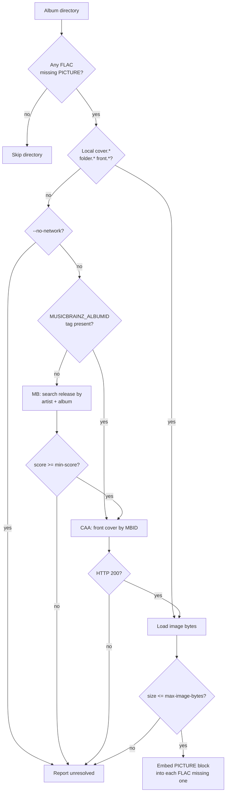

# albumart: Embed album art into FLAC files

**Author:**
**Reviewers:**
**Status:** Draft
**Last Updated:** 2026-06-22
**GitHub Issue:**

<!-- Status lifecycle: Draft -> Approved -> Implemented (v1) -> Implemented (v2) -->
<!-- Update status as the design progresses through review and implementation. -->

## Motivation

A meaningful fraction of the FLAC files in the maintainer's library have no
embedded album art. cmus and most other players fall back to either nothing or
a noisy guess from sidecar files, which makes the "now playing" view feel half
broken. Manually opening each album in a tag editor to paste a JPEG is exactly
the kind of repetitive directory-walking chore the rest of `hmuzik` exists to
eliminate. This adds the missing rung.

In short: a new `hmuzik albumart` subcommand that walks a directory, finds
FLACs without a `PICTURE` metadata block, and embeds front cover art -- using
local image files when present and falling back to MusicBrainz / Cover Art
Archive (CAA) when not.

## Context

`hmuzik` today is a Cobra CLI with one pattern that's worth preserving:

- Subcommand glue lives in `cmd/` (e.g. `cmd/organize.go`, `cmd/recently_added.go`).
- Library logic lives in `internal/<name>/` (e.g. `internal/recentlyadded/`).
- All file-walking commands accept a `--source` and `--dryrun` flag.
- Tag reading uses `github.com/dhowden/tag`. That library can read FLAC's
  `PICTURE` block but cannot write it.

FLAC carries album art in either a native `PICTURE` metadata block (preferred)
or as a base64-encoded Vorbis comment `METADATA_BLOCK_PICTURE` (legacy).
Writing requires re-serializing the FLAC metadata header before the audio
frames -- the audio payload itself is untouched. The canonical Go pairing for
this is `github.com/go-flac/go-flac/v2` plus `github.com/go-flac/flacpicture/v2`.

MusicBrainz exposes a JSON web service at `musicbrainz.org/ws/2/`. Each
release has an MBID; given an MBID, the Cover Art Archive serves the front
cover at `coverartarchive.org/release/{mbid}/front`. Both services require a
custom `User-Agent` and MusicBrainz enforces a strict 1 req/sec rate limit per
client.

What's broken about the current state: nothing in `hmuzik` writes FLAC
metadata, so there's no shared writer to reuse. We'll be adding the first
write-path through FLAC files, which deserves the design attention.

## Recommendation

Add a new `hmuzik albumart` subcommand backed by an `internal/albumart/`
package. Process the source tree one **album directory** at a time -- not one
file at a time -- because every FLAC in a typical album directory shares the
same cover, and grouping lets us pay the MusicBrainz lookup cost once per
album instead of once per track.

For each album directory, resolve a cover image via this priority chain:

1. Local image file in the same directory (`cover.{jpg,jpeg,png}`,
   `folder.{jpg,jpeg,png}`, `front.{jpg,jpeg,png}`, case-insensitive).
2. Cover Art Archive lookup using a `MUSICBRAINZ_ALBUMID` Vorbis comment if
   present on any FLAC in the directory.
3. MusicBrainz release search by `(album-artist, album)` tags, picking the
   highest-scoring result above an auto-accept threshold, then CAA lookup
   against that MBID.

Embed the resolved image as a `PICTURE` block of type 3 (Front Cover) into
every FLAC in the directory that lacks a picture block. Skip files that
already have one unless `--force` is set. A persistent on-disk cache keyed by
MBID prevents repeated remote calls across invocations.

This is the smallest design that addresses the actual library state (mixed:
some albums have local art, some don't) without dragging in interactive
review, multiple providers, or image processing -- those are deferred.

## Goals

- New subcommand `hmuzik albumart -s <dir>` that recursively scans for FLAC
  files lacking a `PICTURE` block and embeds front cover art.
- Local-file source: detect and embed `cover.*` / `folder.*` / `front.*` from
  the album directory before any network call.
- Remote source: MusicBrainz release resolution (by MBID tag, then by
  artist+album search) followed by Cover Art Archive download.
- Threshold-based auto-accept on MusicBrainz search results: do not embed
  art from a release whose MB score is below the configured floor.
- `--dryrun` flag that prints planned embeddings without modifying any file.
- `--force` flag that overwrites existing picture blocks.
- Persistent disk cache for both MusicBrainz lookups and CAA images, keyed by
  MBID, so re-runs across the library are cheap.
- Compliance with MusicBrainz rate limit (1 req/sec) and `User-Agent`
  requirement.
- Atomic file replacement (write to temp, rename) so a crash mid-write
  cannot truncate a FLAC.

## Non-Goals

- MP3, M4A, AIFF, Ogg. FLAC only in v1. The `internal/albumart` package will
  be shaped so additional formats can be added later, but the writer paths
  for ID3v2 / MP4 atoms / etc. are out of scope.
- Image resizing, re-encoding, or quality normalization. We embed bytes
  unchanged. If CAA returns a 4000x4000 PNG, that's what gets embedded.
- Multi-image embedding (back cover, booklet, disc, artist). Front cover
  only.
- Interactive confirmation. No TUI, no `y/N` prompt per album. Decisions are
  made up-front via the threshold + dryrun workflow.
- Multiple cover-art providers (Discogs, Last.fm, fanart.tv). CAA only.
- "Repair" mode that re-evaluates already-embedded art. If a file has any
  `PICTURE` block, it's left alone unless `--force` is set.
- Tag editing of anything other than the picture blocks. No artist/album
  cleanup as a side effect.

## Design

### Subcommand surface

```
hmuzik albumart [flags]

Flags:
  -s, --source string       source directory to scan (required)
  -r, --dryrun              report planned embeddings without writing
  -f, --force               overwrite existing PICTURE blocks
      --no-network          skip MusicBrainz / CAA; local sources only
      --min-score int       MusicBrainz auto-accept threshold (default 95)
      --cache-dir string    cache root (default $XDG_CACHE_HOME/hmuzik/albumart)
      --user-agent string   override the User-Agent sent to MB/CAA
      --max-image-bytes int hard cap on embedded image size in bytes (default 5_000_000)
```

The subcommand glue lives in `cmd/albumart.go`; the actual work lives in
`internal/albumart/`. This mirrors `cmd/recently_added.go` /
`internal/recentlyadded/`.

### Package layout

```
internal/albumart/
    scan.go        directory walk, album grouping by parent dir
    flacrw.go      FLAC read/write wrapper around go-flac + flacpicture
    local.go       local file resolver (cover.* / folder.* / front.*)
    musicbrainz.go MB client: rate limiter, User-Agent, release search & lookup
    caa.go         Cover Art Archive client
    cache.go       on-disk cache (MBID lookups + image bytes)
    resolver.go    orchestrates the priority chain
    albumart.go    public API consumed by cmd/
```

### Resolution pipeline



### Album grouping

A FLAC's "album directory" is its immediate parent directory. We don't try to
infer the album from tags for grouping -- the directory is the unit. This is
simple, matches how `organize` arranges the library, and avoids surprising
behavior in mixed directories.

Within a directory:

- Read tags from every FLAC.
- Determine the album identity by majority vote on
  `(albumartist|artist, album)`. If a directory has tracks from two albums,
  log a warning and skip that directory. (This is rare in a tag-tidied
  library and not worth solving in v1.)
- Collect any `MUSICBRAINZ_ALBUMID` values; if they agree, use that MBID.

### FLAC read/write

Use `github.com/go-flac/go-flac/v2` to parse the metadata header, inspect
existing blocks for `BlockTypePicture`, and append a new block built with
`github.com/go-flac/flacpicture/v2.NewFromImageData`. Picture type is `3`
(Front Cover); MIME comes from the source (`image/jpeg` or `image/png`).

Writes are atomic: serialize to a sibling temp file in the same directory,
`fsync`, then `os.Rename` over the original. Same-directory rename is atomic
on POSIX filesystems, which is what we ship for.

### MusicBrainz client

- HTTP client with a single-token bucket limiter at 1 req/sec.
- Required `User-Agent` of the form `hmuzik/<version> ( <contact> )`.
  Default contact comes from the `git config user.email` baked into the
  binary at build time, overridable via `--user-agent`.
- Endpoints used:
  - `GET /ws/2/release/?query=artist:"X" AND release:"Y"&fmt=json` for
    search.
  - `GET /ws/2/release/{mbid}?fmt=json` for direct lookup when we already
    have the MBID (optional; primarily for caching release metadata).
- We pick the top result whose `score` field is >= `--min-score`. Ties are
  broken by preferring official album releases (`release-group.primary-type
  == "Album"` and `status == "Official"`).

### Cover Art Archive client

- `GET https://coverartarchive.org/release/{mbid}/front` returns the front
  cover (a `302` to the actual image; the standard Go HTTP client follows
  redirects by default).
- `404` is a normal outcome ("no art known for this release") and is
  cached as a negative result with a short TTL.
- `Accept: image/jpeg, image/png` so we don't get GIFs we'd then have to
  reject.

### Cache

On-disk under `$XDG_CACHE_HOME/hmuzik/albumart/` by default:

```
cache/
  mb/
    <sha1(artist|album)>.json   release search result (TTL: 30 days)
  images/
    <mbid>.{jpg,png}            front cover bytes (TTL: 30 days)
    <mbid>.404                  negative cache marker (TTL: 1 day)
```

The TTLs are deliberately long. Album art is overwhelmingly stable; if a user
wants a fresh fetch they pass `--force` and clear the cache directory.

### Failure modes and reporting

Every album directory produces exactly one outcome record:

| Outcome | Meaning |
|---|---|
| `embedded(local)` | Picture block written from a local file. |
| `embedded(caa)`   | Picture block written from CAA. |
| `skipped(has_picture)` | At least one FLAC already had a picture, no `--force`. |
| `skipped(mixed_album)` | Directory contains tracks from multiple albums. |
| `unresolved(no_match)` | No local file and no MB result above threshold. |
| `unresolved(no_art)` | MB match found but CAA had no front cover. |
| `unresolved(network)` | Transient HTTP/timeout error. |
| `error(write)` | FLAC write failed; original left intact. |

The command exits 0 if every directory ended in `embedded(*)`, `skipped(*)`,
or `unresolved(*)`. It exits non-zero only on `error(*)` outcomes -- i.e.
"the operation can't fail just because we couldn't find art."

## Long-term Vision

Where this is headed if it earns its keep:

- **Multiple formats.** Generalize `internal/albumart` so MP3 (ID3v2 APIC),
  M4A (`covr` atom), and Ogg can plug in. The resolver pipeline is
  format-agnostic; only the writer changes.
- **Multiple providers.** Plug Discogs and fanart.tv in behind a provider
  interface, with a configurable priority list. CAA stays the default.
- **Image hygiene.** Optional max-dimension cap with re-encode to JPEG
  quality 90, so pathological 8000x8000 PNGs don't bloat a library by tens
  of GB.
- **Companion `albumart-extract` subcommand.** Reverse direction: pull
  embedded art out to `cover.jpg` next to the FLACs, for players that prefer
  sidecar files.
- **Review TUI.** An interactive mode for the long tail of low-confidence
  matches, surfaced separately from the auto-embed flow so it never blocks
  the batch path.
- **Library-wide health report.** `hmuzik albumart --report` prints what's
  missing without touching anything, so it can be wired into a periodic job
  alongside `recently-added`.

## MVP Scope

What we ship in v1:

- `hmuzik albumart` subcommand with the flags listed above.
- FLAC-only writer.
- Local + CAA (via MBID tag) + MusicBrainz search resolution chain.
- Disk cache.
- Per-album-directory grouping with one outcome per directory.
- Dryrun and force flags.

What is explicitly deferred to a later phase but the design must not block:

- Non-FLAC formats. The writer is isolated behind a small interface in
  `flacrw.go` so adding `mp3rw.go` later is additive.
- Image re-encoding / resizing. Bytes are passed through unchanged today;
  inserting a normalizer is a single call site in `resolver.go`.
- Additional providers. The CAA client is the only implementation of an
  unstated `coverProvider` interface in v1; we'll formalize the interface
  when the second provider arrives, not before.

The MVP is sufficient because the maintainer's library is FLAC-dominant,
already tagged well by `organize`, and most gaps are either "the rip didn't
include cover.jpg" (rung 1) or "old rip with no tags beyond artist/album"
(rung 3). The MVP covers both.

## Alternatives Considered

### Local-only (rung 1)

**Description:** Walk the directory; if `cover.*` / `folder.*` / `front.*`
is present, embed it; otherwise skip. No network calls, no MusicBrainz, no
CAA.

**Why rejected:** It addresses maybe 60% of the gap. A meaningful slice of
the library was ripped without a sidecar image, and the entire point of this
feature is to close that gap. We'd be back here in a month adding the remote
fetcher anyway.

### Local + full multi-provider fetcher with interactive review (rung 3)

**Description:** Local resolver, plus MusicBrainz/CAA, plus Discogs, plus a
TUI that surfaces every ambiguous match for `y/N` confirmation. Optional
image normalization.

**Why rejected:** Real scope creep for a CLI utility. The multi-provider
interface and TUI both deserve their own design once we have evidence that
CAA alone misses too much. Shipping rung 2 first gives us that evidence at a
fraction of the cost.

### Do Nothing / Minimal

**Description:** Leave album art management to a third-party tool like
`beets` or a tag editor. `hmuzik` does directory layout, m3u, and recently-
added; let other tools own art.

**Why rejected:** The maintainer already runs `hmuzik` over the library
regularly. Adding `albumart` keeps the "one tool walks the library and fixes
things" workflow intact. Pulling in `beets` for one job means learning and
configuring a second tool whose worldview ("library DB") collides with
`hmuzik`'s ("the filesystem is the database").

## Security & Privacy Considerations

- **Network exposure.** This is the first `hmuzik` feature that talks to the
  internet. Outbound HTTPS to `musicbrainz.org` and `coverartarchive.org`
  only; no inbound listeners. `--no-network` disables it entirely for users
  who object.
- **PII in User-Agent.** MusicBrainz requires a contact string. Defaulting
  it to a baked-in build-time email is convenient but leaks an address on
  every request. The `--user-agent` flag exists so it can be overridden, and
  the default will use the project URL rather than a personal email.
- **Untrusted bytes from CAA into local files.** We embed image bytes
  fetched over the network into local FLACs. The `--max-image-bytes` cap
  bounds size, and we restrict accepted MIME types to `image/jpeg` and
  `image/png`. We do *not* parse the image -- the bytes are opaque to us --
  so malformed-image CVEs in our process are not a concern, but a poisoned
  image could in theory exploit a downstream player. This is the same risk
  surface as any other album art a user has ever downloaded; we accept it.
- **Cache poisoning.** The on-disk cache lives under the user's own
  `$XDG_CACHE_HOME`. No special hardening beyond standard file permissions.

## Open Questions

1. Default `--min-score`: 95 is conservative. Is the user's library
   well-tagged enough that 90 would be safer (more matches, slightly higher
   wrong-album risk)?
2. Should the default `User-Agent` contact be the project's GitHub URL
   (`github.com/heatxsink/hmuzik`) rather than an email? Leaning yes.
3. Negative-cache TTL for CAA 404s: 1 day, 7 days, or 30 days? Short means
   we re-check often when CAA gets new uploads; long means we waste fewer
   requests on the long tail.
4. Atomic-rename semantics on the maintainer's actual filesystem (likely
   ext4 or btrfs on the Surface Linux box) are fine, but if anyone ever
   runs this against a FUSE-mounted SMB share, the rename guarantee
   weakens. Document the limitation, or add an `--in-place` fallback?
5. Do we want a `--print-unresolved` mode that lists directories without art
   for piping into a downstream script, separately from `--dryrun`?
